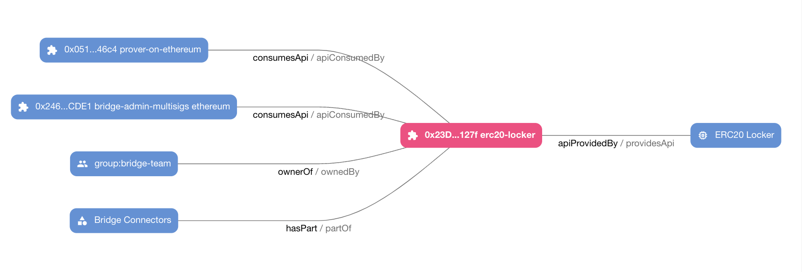
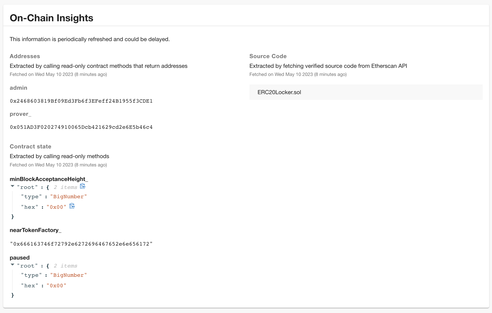

<picture>
  <source media="(prefers-color-scheme: dark)" srcset="docs/imgs/logos/header-logo-green.svg">
  <source media="(prefers-color-scheme: light)" srcset="docs/imgs/logos/header-logo-black.svg">
  
</picture>

Blockchain Radar for Backstage is a collection of plugins that aims to solve asset management on EVM chains and on [NEAR](https://near.org/).

## Goals

- Keep an inventory of contracts, multisig safes and access keys
- Provide insights about the state of on-chain access management

## Features

- First-class support for smart contracts & multisigs in [Software Catalog](https://backstage.io/docs/features/software-catalog/)
  - Cross-contract relationships mapping via on-chain state ingestion
  - Etherscan/Blockscout source code and verification status discovery
- Multisig support: [Gnosis Safe](https://safe.global/) and [SputnikDAO](https://astrodao.com/)
  - Policy & configuration tracking
  - Mapping of the signers to the User entities
- NEAR accounts & EVM EOA addresses management
- Unknown & deprecated access keys tracking
- Security tiering
- Exporting data
  - Handlebars templates
  - Datadog metrics

## Getting started

- [Plugin setup](docs/setup.md)
- [Usage examples](docs/usage.md)

## How does it work?

The traditional asset management model does not map well to the
blockchain world so the plugin reuses the classic Backstage entites in order to
keep things simple:

- Contract source code: `kind:Component`, `type:contract`
- Deployed contract: `kind: API`, `type: contract-deployment`
- Multisig component: `kind: Component`, `type: multisig`
- Multisig safe deployment: `kind: API`, `type: multisig-deployment`
- NEAR Account / EVM EOA address: `kind: Resource`, `type: signer-address`
- NEAR AccessKey: `kind: Resource`, `type: access-key`

It uses `deployedAt` and `interactsWith` attributes in the spec (e.g. like [here](https://github.com/aurora-is-near/rainbow-token-connector/blob/589e6f5ece013f9747b37e64e793dc373591b1fb/erc20-connector/.catalog-info.yaml#L21)) to start tracking on-chain state and establishing relationships with other entities.

Additionally, it introduces `interactsWith`, `keys` and `deprecated` attributes to `User` entities.
It allows the plugin to automatically establish relationships between users and contracts, multisig signers and access keys.

In this example the relationships were not specified with `interactsWith` spec,
instead they were automatically ingested by the plugin by calling the view
methods on the contract, and mapping extracted addresses to the existing
entities in the catalog.

## Exporting

You can periodically export the list of all multisigs to a github repository with [github-helpers](https://github.com/aurora-is-near/github-helpers).

Additionally, you can find examples of how to send blockchain metrics to Datadog.

- [Exporting: templates and metrics](./docs/exporter.md)

## Roadmap

- Key/signer inactivity discovery
- Support for multiple SputnikDAO groups
- Support for near-plugins introspection
- Support for OpenZeppelin RBAC & Proxy introspection
